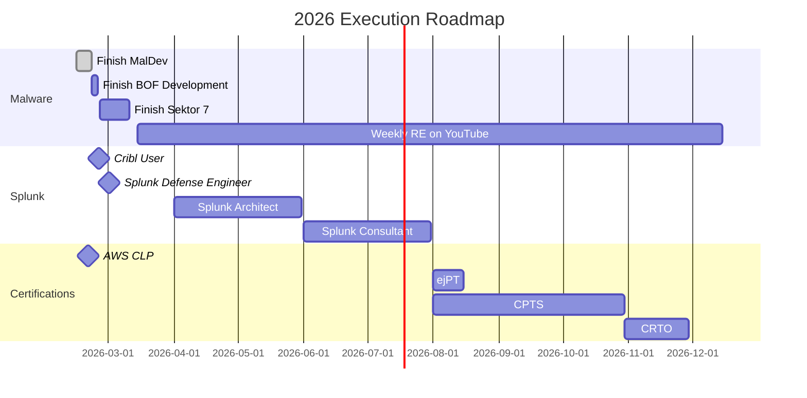

---
# the default layout is 'page'
icon: fas fa-info-circle
order: 1
mermaid: true
---

I am a Security Engineer.

I enjoy detection engineering and finding out how things tick. I enjoy solving complex problems and discovering new ways to discover evasion by attackers. I have worked a long time to sharpen my spear to enable soc analysts and threat hunters. My work translates caffeine and logs into results for my fellow analysts.

```c
#include <stdio.h>
#include <stdbool.h>
#include <stdlib.h>

bool caffeinated(int cups) {
    return cups >= 2;
}

int main(void) {
    char buffer[100];
    long cups;
    char *endptr;

    printf("How many cups of coffee did you drink? ");

    if (fgets(buffer, sizeof(buffer), stdin) == NULL) {
        printf("Input error.\n");
        return 400;
    }

    cups = strtol(buffer, &endptr, 10);

    if (endptr == buffer || *endptr != '\n') {
        printf("Invalid input. Enter a number.\n");
        return 422;
    }

    bool user = caffeinated((int)cups);
    bool logs = true;

    if (user && logs) {
        printf("Detections generated for analysts.\n");
        return 0;
    }

    printf("No detections generated.\n");
    return 404;
}
```

I have a strong interest in **malware analysis** and I am actively learning **malware development** to better understand how offsec personnel think. I am currently learning from Maldev Academy, Sektor 7 training and Bof Development course. Learning how malware is built directly improves how I detect, monitor and analyze malware.

Some of my favorite projects have been [Detection-Wizard](https://github.com/Infinit3i/Detection-Wizard), [Defensive-Rules](https://github.com/Infinit3i/Defensive-Rules), [IOC-Detections](https://github.com/Infinit3i/IOC-Detections), [Hunt-AI](https://github.com/Infinit3i/hunt-ai).

## Great People to follow

- [0xtriboulet](https://steve-s.gitbook.io/0xtriboulet) <a href="https://github.com/0xTriboulet" target="_blank" aria-label="0xtriboulet GitHub"><i class="fab fa-github"></i></a>
- [Drone-spec](https://blog.dronemothership.work/Wizardintro.html) <a href="https://github.com/Drone-spec" target="_blank" aria-label="Drone GitHub"><i class="fab fa-github"></i></a>
- [Cyber Yeti](https://www.thecyberyeti.com/) <a href="https://www.youtube.com/@jstrosch" target="_blank" aria-label="Cyber Yeti YT"><i class="fab fa-youtube"></i></a> <a href="https://github.com/jstrosch" target="_blank" aria-label="Cyber Yeti GitHub"><i class="fab fa-github"></i></a>
- [Lame Creations](https://lamecreations.com/) <a href="https://www.youtube.com/@lamecreations_guides" target="_blank" aria-label="Lame Creations YT"><i class="fab fa-youtube"></i></a>
- [Net-Doge](https://github.com/Net-Doge)
- [Deej](https://github.com/deej1721)
- [drngd0tter](https://github.com/Deranged0tter)
- [KooshBox](https://github.com/JuanParks)
- [NickBolles](https://nickbolles.com/) <a href="https://github.com/NickBolles" target="_blank" aria-label="Cyber Yeti GitHub"><i class="fab fa-github"></i></a>
- [0xSteevo](https://github.com/Steveo21)
- [MTU](https://blog.sectorr.dev/)
- gooseduckduck

